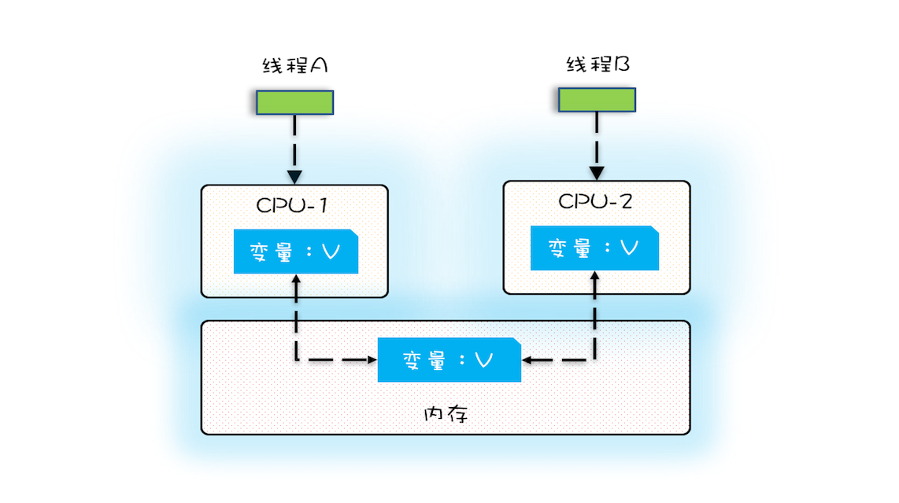
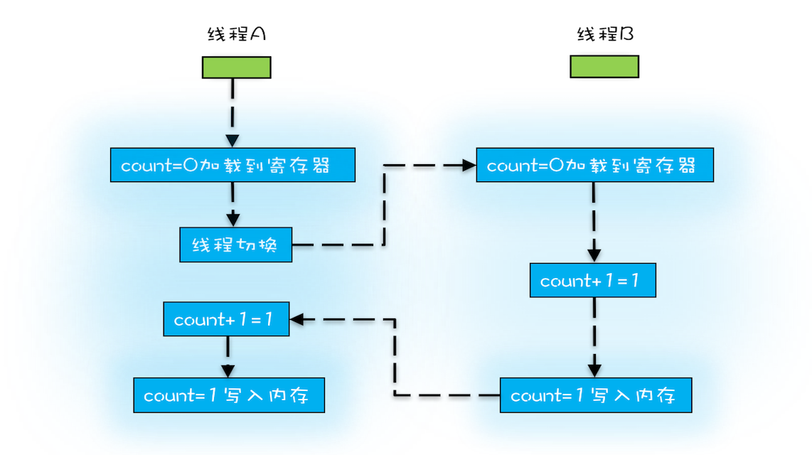
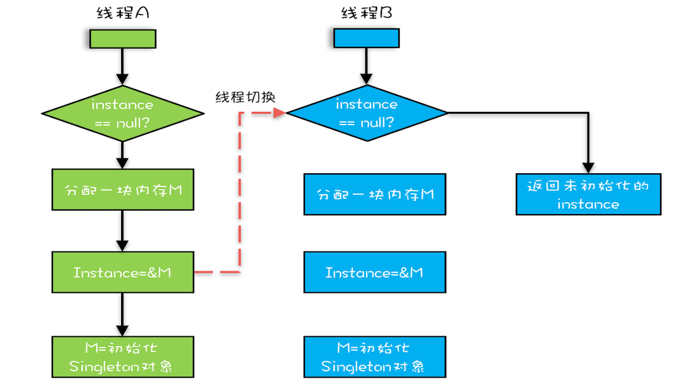

# 01 可见性、原子性和有序性问题：并发编程Bug的源头

## 原因

由于CPU、内存、I/O的操作速度呈指数级增长，所以为了弥补这三者速度的差异，增加了下面这些措施来提升程序的性能：

* CPU增加了缓存，弥补CPU和内存之间速度的差异 --- 可能会导致可见性问题
* 操作系统增加了进程、线程，以时分复用CPU，弥补CPU和I/O之间速度的差异 --- 可能会导致原子性问题
* 编译程序优化指令执行的次序，使的缓存能够更加合理的利用 --- 可能会导致有序性问题
  但这些增加性能的操作也导致了并发编程的三个问题

## 可见性



验证共享变量存在可见性问题的代码见本包下：VisibilityTest.java
运行该代码发现输出结果如下：

```
读线程：开始监视flag...
写线程：flag已设为true
```

说明reader线程一直读取的是更新前的值，writer线程的修改对reader线程不可见
如果需要修改这个程序，可以为 `flag`变量增加 `volatile`修饰符，修改后输出如下：

```
读线程：开始监视flag...
写线程：flag已设为true
读线程：检测到flag为true
主线程：程序结束
```

说明增加了 `volatile`修饰符的变量的修改对别的线程是可见的

## 原子性



运行程序会发现最后输出结果小于2000，原因如上图所示

> 该示例中特意为count变量使用volatile修饰，以避免可见性问题
> 相加次数设置1000的原因是次数太少会导致线程一执行完线程二刚开始执行或线程还没来得及切换任务就执行完了

## 有序性
```java
public class Singleton {

    static Singleton instance;

    static Singleton getInstance() {
        if (instance == null) {
            synchronized (Singleton.class) {
                if (instance == null) {
                    instance = new Singleton();
                }
            }
        }
        return instance;
    }
}
```
上述代码因为`instance = new Singleton()`非原子性操作，该操作的过程如下：
1. 分配一块内存M
2. 在内存M上初始化Singleton对象
3. M的地址赋值给instance变量

该顺序可能会被操作系统和编译器优化成132，这就可能会导致空指针异常


