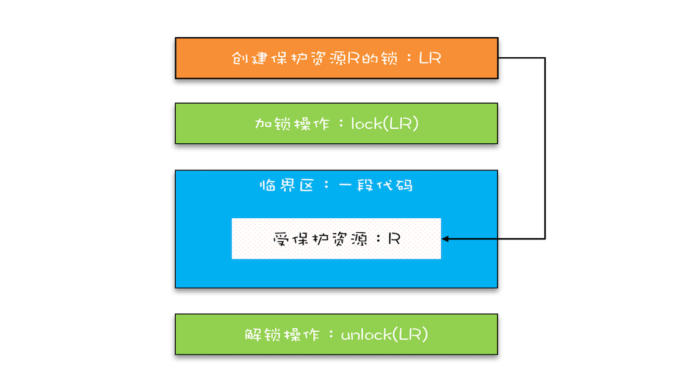

# 互斥锁（上）：解决原子性问题
一句话总结：互斥锁解决了线程调度导致的原子性问题
## 锁模型

## synchronized
```java
class X {
  // 修饰非静态方法
  synchronized void foo() {
    // 临界区
  }
  // 修饰静态方法
  synchronized static void bar() {
    // 临界区
  }
  // 修饰代码块
  Object obj = new Object();
  void baz() {
    synchronized(obj) {
      // 临界区
    }
  }
}  
```
synchronized关键字已经帮我们做了加锁和释放锁的操作，所以我们只需要指定使用什么对象作为锁就行
1. 可以在synchronized后指定要使用的锁对象，如果不指定则会使用默认对象作为锁
2. 修饰静态方法和代码块时默认使用的锁是当前类的Class对象
3. 修饰非静态方法和代码块时默认使用的锁是当前实例对象this
## 锁和受保护资源的关系
受保护的资源和锁之间的关联关系是N:1的关系，即我们可以使用同一个锁锁住多个资源，却不能使用多个锁锁同一个资源，多个锁会导致资源访问没有互斥关系，可能会导致并发问题

