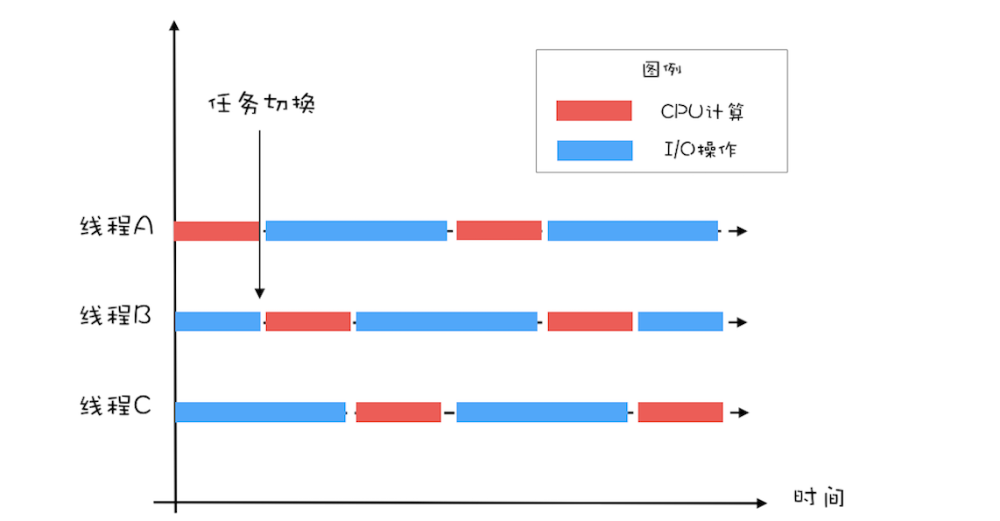

# Java线程（中）：创建多少线程才合适

## 为什么使用多线程

使用多线程为了提升性能，度量性能的指标很多，核心的有下面两个：

* 延迟：延迟指的的发出请求到收到相应这个过程的时间，时间维度
* 吞吐量：吞吐量指的是单位时间能处理请求的数量，空间维度
  所以提升性能就是要降低延迟，增加吞吐量

## 多线程应用场景

优化性能有两个方向：

1. 优化程序算法
2. 提高硬件性能

而多线程的作用主要就体现在第二点，我们第一章就讲到了，操作系统为了增加硬件性能已经做了CPU缓存等操作，使用多线程则可以提高硬件的利用率

### 多线程提高吞吐量

假设一个程序的CPU计算和I/O操作的耗时比例是1:1且交叉执行，那么单线程如下图所示：

从上图可以看出，单线程时该程序执行时CPU和I/O设备的利用率均之后50%
而使用两个线程的效果如下图所示：

在增加了一个线程之后可以两个线程交替执行CPU或I/O操作会提升两个设备的利用率达到100%
且在相同的时间内执行的程序为单线程的两倍，也就是吞吐量翻了一倍
**如果CPU和I/O设备的利用率都很低，那么可以通过增加线程数来提高吞吐量**

### 多线程提高延迟

假设我们需要计算1+2+...+100亿的结果，可以分解任务为计算[1,25亿)，计算[25亿,50亿)，[
50亿,75亿)，[75亿,100亿]四个任务且分配四个线程执行，如下图所示：

假设在4核的CPU上运行这个程序则比单线程运算快大约四倍，降低了程序的延迟

## 创建多少线程合适

对于CPU密集型计算，多线程的作用是提高多核CPU的利用率，所以理论上CPU有几个核就创建几个线程就可以了，更多的线程只会增加线程切换的成本
但是实际中我们一般把线程的数量设置为：CPU核心数 + 1，这样当线程因为偶尔的内存页失效或其他原因导致阻塞时，这个额外的线程可以顶上，从而保证CPU的利用率

对于I/O密集型计算，如果CPU运算和I/O操作的耗时比为1:1，那么设置两个线程就能使CPU和I/O设备的利用率达到100%
如果CPU运算和I/O操作的耗时比为1:2时，设置三个线程能使CPU和I/O设备的利用率达到100%，计算过程如下图：

所以我们单核CPU时I/O密集型计算的线程数应该设置为：1 + (I/O耗时 / CPU耗时)，这样就会使一个线程在执行I/O操作时别的线程能执行对应的CPU运算
多核CPU的线程数为：CPU核数 * (1 + (I/O耗时 / CPU耗时))

