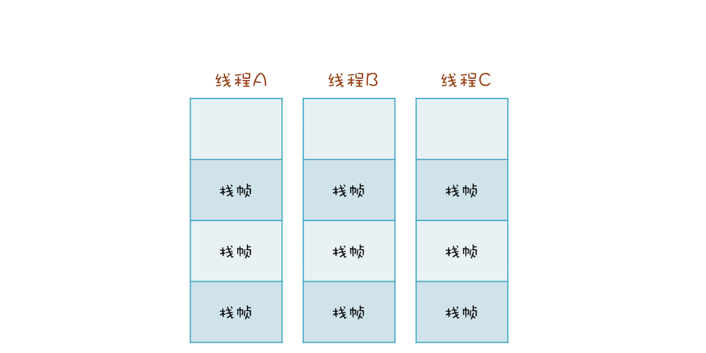

# Java线程（下）：为什么局部变量是线程安全的

## 方法是如何执行的

如图所示每个线程在运行时会构建一个调用栈，每个方法在调用栈里都有自己独立的空间叫做栈帧。当调用方法时会创建一个栈帧然后进行压栈操作，方法执行结束会执行弹栈操作
栈帧和方法的生命周期是一起的
而局部变量是存储在对应方法的栈帧中的，所以在线程之间是不共享的，也就没有线程安全问题了

## 线程封闭

线程封闭，即只在单线程中访问数据来避免并发问题，例如局部变量不会在线程之间共享，所以不会有并发问题