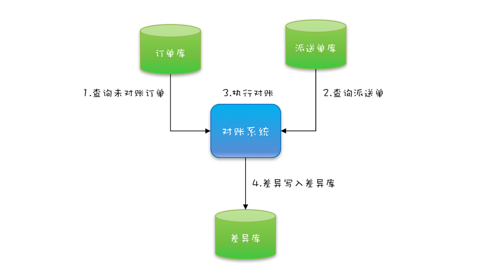
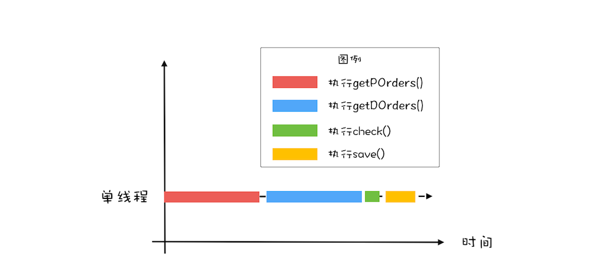
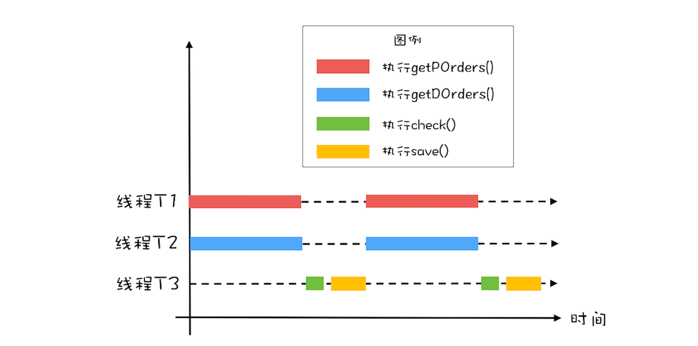
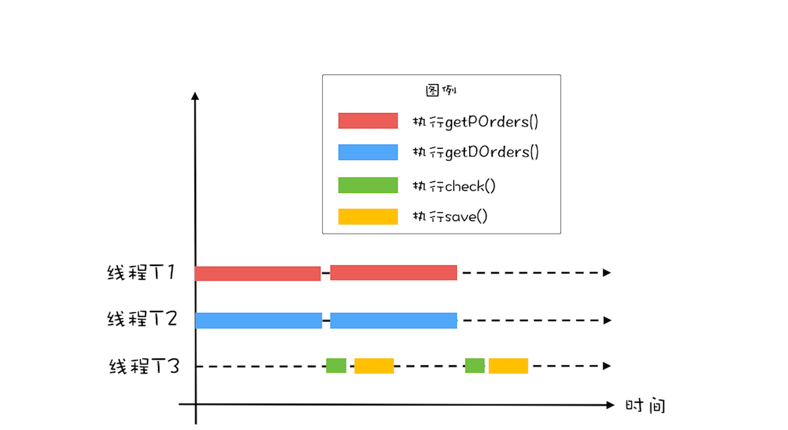

# CountDownLatch和CyclicBarrier：如何让多线程步调一致

即使用CountDownLatch和CyclicBarrier解决线程同步问题

例如现有程序需要做下面的操作：



## CountDownLatch

为了优化程序性能，我们可以时没有依赖关系的前两步并行执行

如上图所示，将耗时最长的两步查询并行执行后能优化性能，增加程序吞吐量
那么我们就要考虑负责查询功能的两个线程和主线程之间的同步问题了
目前的依赖关系是第三步依赖第一步和第二步的执行结果，第四步依赖第三步的执行结果
我们可以在主线程调用查询线程的join()
方法来进行同步，但是如果使用线程池的方式就会导致我们没法获取到具体执行任务的线程，且线程池中的线程为了复用在执行完后也不会进入TERMINATED状态，所以join()
方法永远也不会返回

Java工具类中存在CountDownLatch可以帮助我们实现这个功能，该工具类提供了下面三个基础操作方法：

```java
CountDownLatch(int count);

void countDown();

void await();
```

CountDownLatch内部会维护一个计数器，构造方法传入int类型的值会初始化该计数器
countDown()会使计数器减1，await()方法会阻塞线程，知道计数器减到0

CountDownLatch使用示例见本包下CountDownLatchExample.java

## CyclicBarrier

上面使用CountDownLatch确实提升了性能，但是还可以继续提升
那就是把第三步和第四步也同第一步和第二步并行处理，如下图所示

整个的工作流程是T1完成第一步和T2完成第二步运行之后交给T3执行第三步和第四步然后T1和T2继续分别执行各自的任务
示例代码见本包下CyclicBarrierExample.java
使用CyclicBarrier优化之后整个程序运行一次的时间就等于max(第一步耗时, 第二步耗时)了

## 总结

CountDownLatch主要用来解决一个线程等待多个线程的场景
CyclicBarrier主要用来解决一组线程相互等待且循环执行的场景
