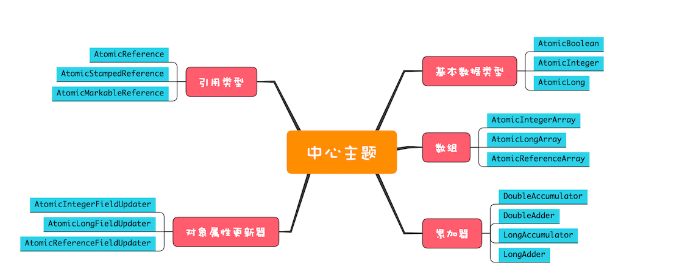

# 原子类：无锁工具类的典范

在之前的章节了我们使用互斥锁加volatile关键字实现了线程安全的累加方法
JDK提供了一系列性能更高的工具类来帮我们实现该类场景，即原子类

使用AtomicLong实现多线程安全累加方法的示例见本包下：`AtomicLongExample.java`

而原子类的性能比加锁方案更高的原因是原子类使用的是无锁方案，对比加锁方案少了加解锁操作和线程切换操作

## 无锁方案的实现原理

原子类能够无锁进行线程安全的累加得益于操作系统提供的CAS(compare and swap)指令
CAS指令有三个参数：共享变量的内存地址、预期值、新值，只有当该内存地址的变量等于预期值时才更新该变量为新值
作为一条CPU指令，操作系统会保证CAS指令的原子性

使用Java模拟该操作见本包下`SimulatedCAS.java`中`boolean cas(int expectValue, int updateValue)`方法

根据代码我们可以看到，CAS操作在存在并发的时候会导致更新失败，所以使用CAS操作一般伴随着自旋

自旋CAS操作见本包下`SimulatedCAS.java`中`void spinCas(int updateValue)`方法

## ABA问题

CAS本质是比较并交换，比较是指我们交换之前获取到的值等于交换之时的变量值，但这两个时间点的相等并不等于该变量值中间时间没有变过

假设先获取值为A，在CAS操作之前被另一线程设置为B，又被另一线程设置为A，这是执行CAS操作也是能成功的，但是变量值是已经变化了的

向我们示例中的变量相加之类的大多数情况我们是不用考虑ABA问题的，但是当原子化更新对象时就要特别注意ABA问题，因为此时变量对象中的属性可能已经变化了

ABA问题示例见本包下`AtomicReferenceExample.java`
运行该程序输出结果：`student = AtomicReferenceExample.Student(id=2, name=李四)`
在原子类引用的对象属性变更之后依然可以通过CAS设置成功，所以可以知道CAS比较的是对象的内存地址

## 原子类概览

### 原子化的基本类型数据

相关实现有：AtomicInteger、AtomicLong和AtomicBoolean

### 原子化的对象引用类型

相关实现有AtomicReference、AtomicStampedReference、AtomicMarkableReference，利用他们可以实现对象引用的原子化更新
对于上面提到的ABA问题，AtomicStampedReference和AtomicMarkableReference可以解决

AtomicStampedReferenceExample是我们要维护一个int类型的stamped戳记，可以理解为版本号
在初始化的时候传入初始值，后面每次执行CAS执行都要传入更新后的值，所以应用程序要自己保证该值不会重复
示例代码见本包下`AtomicStampedReferenceExample.java`

AtomicMarkableReference的实现机制更简单，将版本号简化为了Boolean值

### 原子化数组

相关实现有AtomicIntegerArray、AtomicLongArray和AtomicReferenceArray
利用这些原子类可以更新数组里的每一个元素

### 原子化对象属性更新器

相关实现有AtomicIntegerFieldUpdater、AtomicLongFieldUpdater和AtomicReferenceFieldUpdater
利用他们可以原子化更新对象属性

### 原子化累加器

相关实现有DoubleAccumulator、DoubleAdder、LongAccumulator和LongAdder
这四个类只能用来执行累加操作，不支持CompareAndSwap操作
相比于原子化的基本类型，该实现累加操作速度更快
