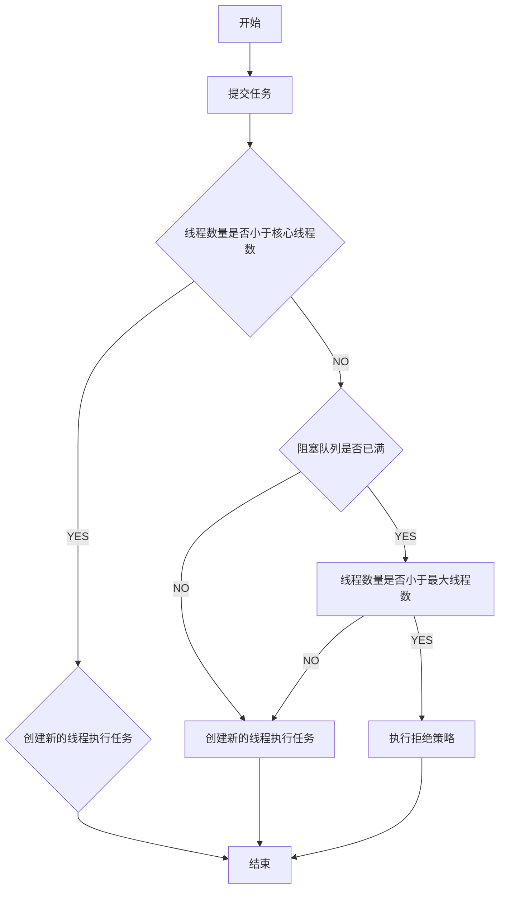

# Executor与线程池：如何创建正确的线程池

在Java中创建一个线程我们只需要`Thread thread = new Thread();`一行代码就行
但在JVM中创建线程是个成本很高的工作，不仅需要调用操作系统内核API，操作系统还要为线程分配一系列资源
所以线程是一个重量级对象，应该避免频繁的创建和销毁
这个时候**线程池**就可以帮助我们解决这个问题

## 线程池是一种生产者-消费者模式

一般意义上的资源池化都是通过池获取对应的资源，然后调用该资源进行各种操作
但是Java中的线程池ThreadPoolExecutor里面并没有类似于下面的获取和释放线程的方法

```java
Thread acquire();

void release(Thread thread);
```

ThreadPoolExecutor采用了生产者-消费者模式来实现，使用方是生产者，线程池是消费者
内部使用BlockingQueue来存储任务
简单线程池实现见本包下`SimpleThreadPool.java`

## 如何使用Java中的线程池

Java提供的线程池工具类中，最核心的是ThreadPoolExecutor.java
该类最完备的构造函数如下，其他的都是提供默认值的重载构造函数

```java
public ThreadPoolExecutor(int corePoolSize,
    int maximumPoolSize,
    long keepAliveTime,
    TimeUnit unit,
    BlockingQueue<Runnable> workQueue,
    ThreadFactory threadFactory,
    RejectedExecutionHandler handler) {
}
```

下面介绍一下这些参数的意义，参考于ThreadPoolExecutor类注释

* corePoolSize &
  maximumPoolSize：分别表示核心线程数和最大线程数，ThreadPoolExecutor使用这两个参数来决定池中线程的数量，当线程数量小于核心线程数时，来新的任务无论是否空闲线程都会新建线程来执行该任务，如果线程数大于等于核心线程数且小于最大线程数，则之后在阻塞队列满的时候才会创建新的线程。我们可以通过将核心线程数和最大线程数设为同一个值来创建一个线程数固定的线程池。另外我们不仅可以在构造函数时指定这两个值，在线程池运行过程中可以通过
  `setCorePoolSize(int corePoolSize)`和`setMaximumPoolSize(int maximumPoolSize)`来动态修改这两个值



* keepAliveTime &
  unit：保持存活时间和时间单位，ThreadPoolExecutor会根据这两个参数确定一个过期时间，当线程数大于核心线程数时，如果有线程空闲时间超过过期时间，那么该线程会被回收。这可以使线程池提交任务没那么频繁的时候减少资源损耗
* workQueue：阻塞队列workQueue用于保存和传输任务，承担了生产者-消费者模式中中介的角色，下面介绍常用的阻塞队列：
    * SynchronousQueue：不存储元素的有界队列，每个put操作必须等待take操作，否则不能添加元素。支持公平锁和非公平锁。
    * ArrayBlockingQueue：使用数组实现的阻塞队列，此队列按照先进先出（FIFO）的原则对元素进行排序。支持公平锁和非公平锁
    * LinkedBlockingQueue：使用链表实现的有界队列，此队列按照先进先出（FIFO）的原则对元素进行排序。此队列默认长度为Integer.MAX_VALUE
* threadFactory：我们可以通过实现ThreadFactory来指定创建线程的方式，例如可以给线程设置有业务意义的名字
* handler：当有界队列满且线程达到最大线程数时，用户再提交的任务会被执行执行的拒绝策略。ThreadPoolExecutor内置了下面四种策略：
    * CallerRunsPolicy：提交任务的线程去执行该任务
    * AbortPolicy：会抛出RejectedExecutionException异常，此策略为默认的拒绝策略
    * DiscardPolicy：不抛出异常，直接丢弃任务
    * DiscardOldestPolicy：丢弃最老的任务，将新任务加入工作队列

## 使用线程池注意事项

* 禁止使用Executors静态工具类创建线程池，因为该工具类很多创建线程池默认使用的都是无界队列LinkedBlockingQueue，在高负载情况下容易导致OOM。所以强烈建议使用有界队列
* 默认拒绝策略会抛出运行时异常，我们要根据业务情况捕获这个异常或自定义拒绝策略。任务里捕获异常的范式如下：

```java
try{
    //业务逻辑
    }catch(RuntimeException x){
    //按需处理
    }catch(
Throwable x){
    //按需处理
    }
```

* 在实际工作中自定义拒绝策略往往和降级策略配合使用