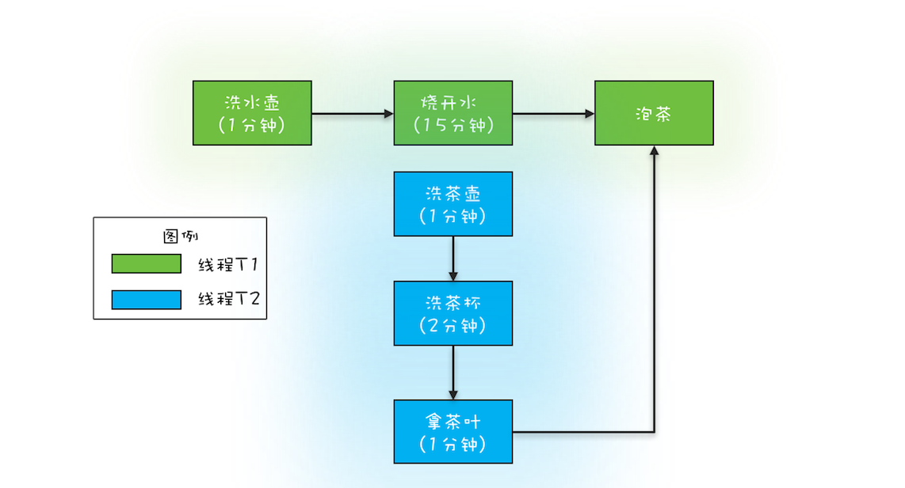

# Future：如何使用多线程实现最优的烧水泡茶程序？

## 如何获取任务执行结果

上一章我们讲到线程池可以通过`execute(Runnable task)`方法提交任务，但是该方法没有返回值，那么当我们需要使用任务的返回值应该怎么做呢？
ThreadPoolExecutor.java的父抽象类AbstractExecutorService.java提供了三个方法供我们使用

```java
// 提交Runnable任务
Future<?> submit(Runnable task);

// 提交Runnable任务及结果引用
<T> Future<T> submit(Runnable task, T result);

// 提交Callable任务
<T> Future<T> submit(Callable<T> task);
```

Runnable接口我们之前已经接触过了，Callable接口的定义如下：

```java
public interface Callable<V> {

    V call() throws Exception;
}
```

可以看到类似于Runnable中的run()方法，Callable接口中也只定义了一个方法call()，区别就是call()方法具有返回值

三个submit()方法的返回值都是Future接口，而Future接口定义了五个方法：

```java
// 取消任务，mayInterruptIfRunning表示如果取消时任务已开始执行是否中断
boolean cancel(boolean mayInterruptIfRunning);

// 判断任务是否已经取消
boolean isCancelled();

// 判断任务是否已经结束
boolean isDone();

// 阻塞获得任务执行结果
V get();

// 支持超时阻塞获得任务执行结果
V get(long timeout, TimeUnit unit);
```

所以我们可以根据这些信息推测获取线程池任务执行结果的步骤：

1. 新建Callable接口或Runnable接口实现类
2. 调用submit()方法向线程池提交任务
3. 调用submit()方法返回的Future接口的get()方法来获取执行结果

注意：

1. 由于Runnable接口中的run()方法没有返回值，所以`Future<?> submit(Runnable task)`
   方法返回的Future调用get()方法恒定返回null，但因为get()方法是阻塞获取任务执行结果，所以我们可以通过该方法判断任务是否执行完成
2. 如果Runnable接口实现类想要获取返回值，可以通过`<T> Future<T> submit(Runnable task, T result)`
   方法实现，可以将返回值对象作为参数传入方法，然后在Runnable实现类中构造函数将该对象传入，在run方法中修改该对象即可，方法返回的Future接口get()
   返回对象即为我们传入的对象。可以理解为传入参数的对象只是传递返回值的媒介

具体的代码示例见本包下FutureExample.java中的代码

## 实现最优的烧水泡茶程序




